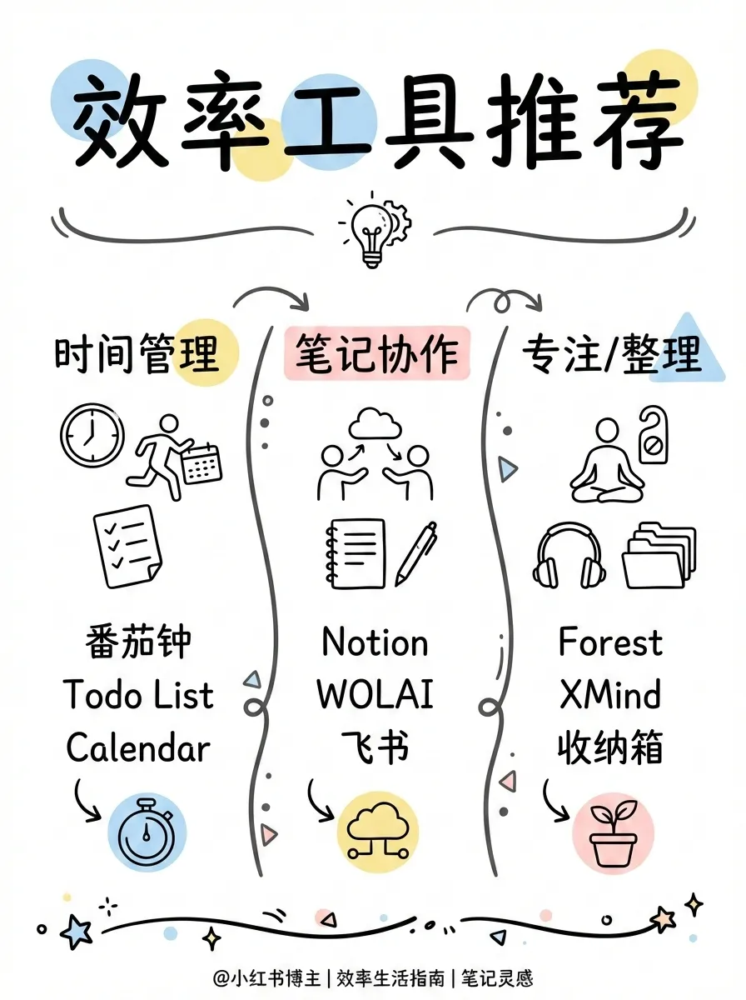
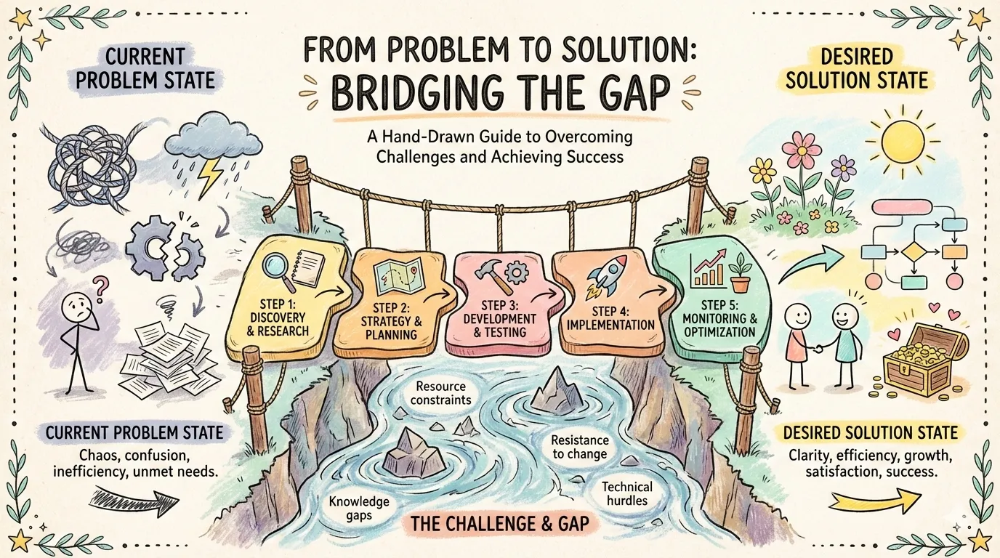
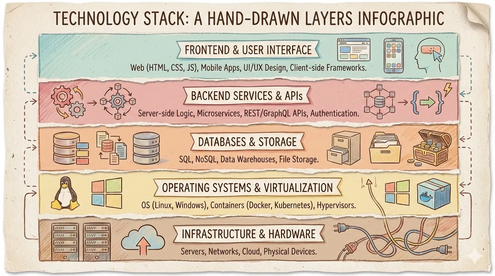
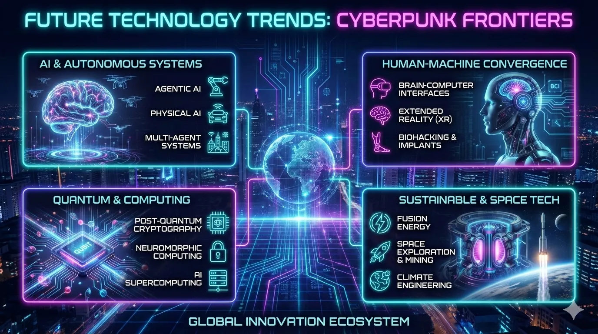
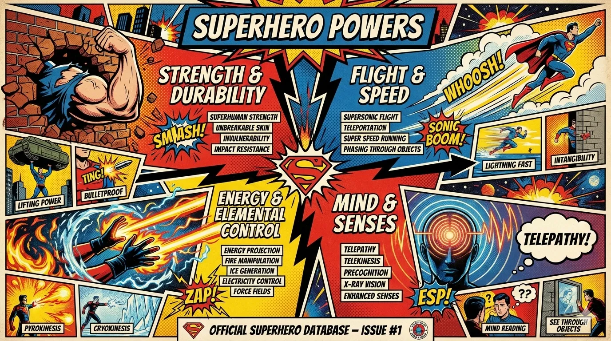
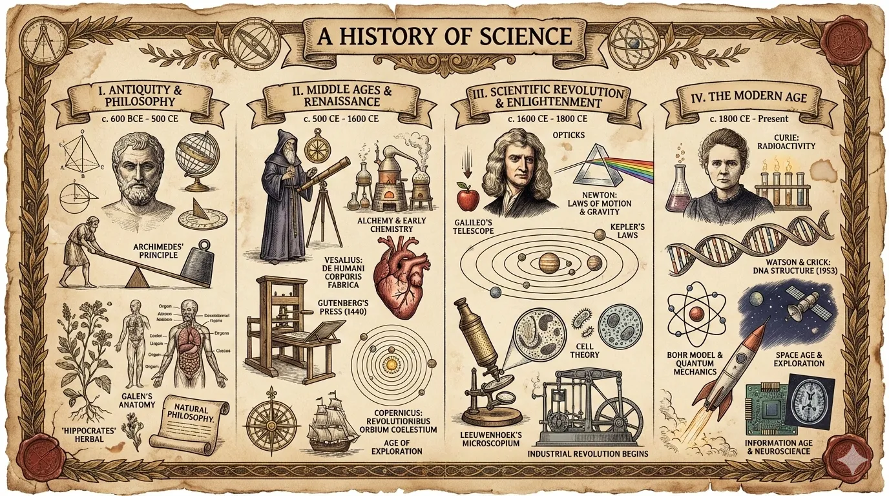
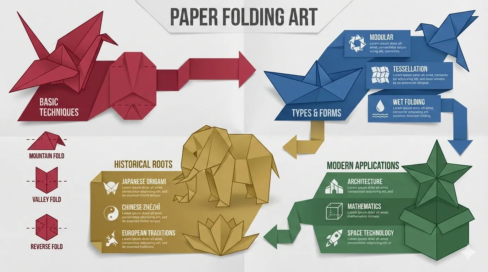
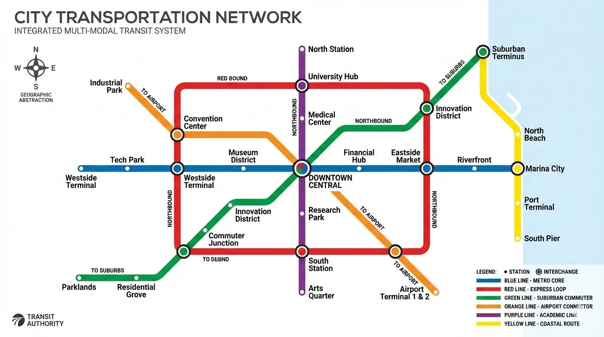
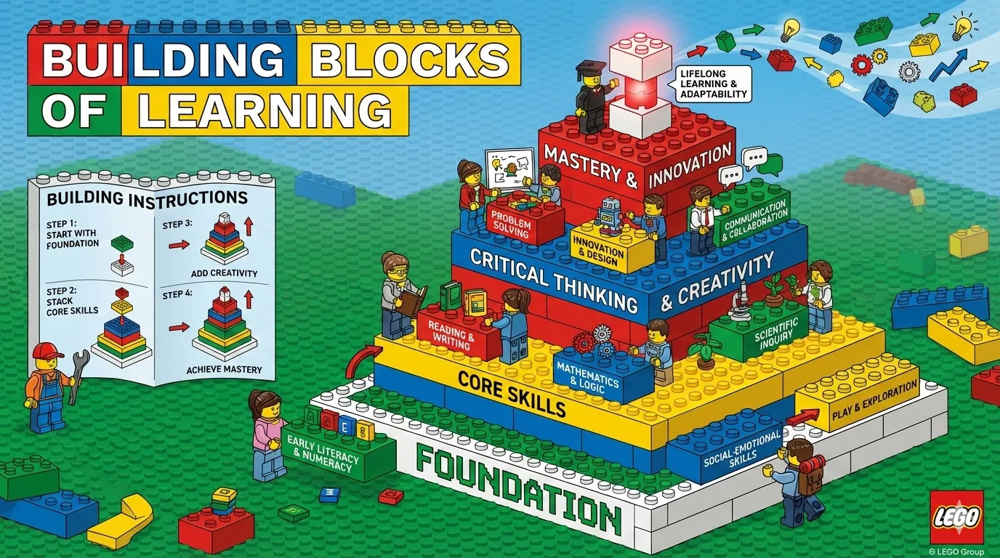

# baoyu-skills-tw

> **📌 這是繁體中文（台灣）在地化同步版本**
>
> 上游：[JimLiu/baoyu-skills](https://github.com/JimLiu/baoyu-skills) | 維護者：[@yelban](https://github.com/yelban)
>
> 所有內容已使用 OpenCC s2twp 轉換為繁體中文（台灣正體）。


[English](./README.md) | 中文

寶玉分享的 Claude Code 技能集，提升日常工作效率。

## 前置要求

- 已安裝 Node.js 環境
- 能夠執行 `npx bun` 命令

## 安裝

### 快速安裝（推薦）

```bash
npx skills add yelban/baoyu-skills.TW
```

### 釋出到 ClawHub / OpenClaw

現在這個倉庫支援把每個 `skills/baoyu-*` 目錄作為獨立 ClawHub skill 釋出。

```bash
# 預覽將要釋出的變更
./scripts/sync-clawhub.sh --dry-run

# 釋出 ./skills 下所有已變更的 skill
./scripts/sync-clawhub.sh --all
```

ClawHub 按“單個 skill”安裝，不是把整個 marketplace 一次性裝進去。釋出後，使用者可以按需安裝：

```bash
clawhub install baoyu-imagine
clawhub install baoyu-markdown-to-html
```

根據 ClawHub 的 registry 規則，釋出到 ClawHub 的 skill 會以 `MIT-0` 許可分發。

### 註冊外掛市場

在 Claude Code 中執行：

```bash
/plugin marketplace add JimLiu/baoyu-skills
```

### 安裝技能

**方式一：透過瀏覽介面**

1. 選擇 **Browse and install plugins**
2. 選擇 **baoyu-skills**
3. 選擇 **baoyu-skills** 外掛
4. 選擇 **Install now**

**方式二：直接安裝**

```bash
# 安裝 marketplace 中唯一的外掛
/plugin install baoyu-skills@baoyu-skills-tw
```

**方式三：告訴 Agent**

直接告訴 Claude Code：

> 請幫我安裝 github.com/yelban/baoyu-skills.TW 中的 Skills

### 可用外掛

現在 marketplace 只暴露一個外掛，這樣每個 skill 只會註冊一次。

| 外掛 | 說明 | 包含內容 |
|------|------|----------|
| **baoyu-skills** | 提供內容生成、AI 後端和日常效率工具技能 | 倉庫中的全部 skills，仍按下方的內容技能、AI 生成技能、工具技能三個分類展示 |

## 更新技能

更新技能到最新版本：

1. 在 Claude Code 中執行 `/plugin`
2. 切換到 **Marketplaces** 標籤頁（使用方向鍵或 Tab）
3. 選擇 **baoyu-skills**
4. 選擇 **Update marketplace**

也可以選擇 **Enable auto-update** 啟用自動更新，每次啟動時自動獲取最新版本。


## 可用技能

技能分為三大類：

### 內容技能 (Content Skills)

內容生成和釋出技能。

#### baoyu-xhs-images

小紅書圖片卡片系列生成器。將內容拆解為 1-10 張卡通風格圖片卡片，支援 **風格 × 佈局** 系統和可選配色覆蓋。

```bash
# 自動選擇風格和佈局
/baoyu-xhs-images posts/ai-future/article.md

# 指定風格
/baoyu-xhs-images posts/ai-future/article.md --style notion

# 指定佈局
/baoyu-xhs-images posts/ai-future/article.md --layout dense

# 組合風格和佈局
/baoyu-xhs-images posts/ai-future/article.md --style notion --layout list

# 覆蓋配色
/baoyu-xhs-images posts/ai-future/article.md --style notion --palette macaron

# 直接輸入內容
/baoyu-xhs-images 今日星座運勢

# 非互動模式（跳過所有確認，適用於定時任務）
/baoyu-xhs-images posts/ai-future/article.md --yes
/baoyu-xhs-images posts/ai-future/article.md --yes --preset knowledge-card
```

**風格**（視覺美學）：`cute`（預設）、`fresh`、`warm`、`bold`、`minimal`、`retro`、`pop`、`notion`、`chalkboard`、`study-notes`、`screen-print`、`sketch-notes`

**配色**（可選顏色覆蓋）：`macaron`、`warm`、`neon`

**風格預覽**：

| | | |
|:---:|:---:|:---:|
|  |  |  |
| cute | fresh | warm |
|  |  |  |
| bold | minimal | retro |
|  |  |  |
| pop | notion | chalkboard |

**佈局**（資訊密度）：
| 佈局 | 密度 | 適用場景 |
|------|------|----------|
| `sparse` | 1-2 點 | 封面、金句 |
| `balanced` | 3-4 點 | 常規內容 |
| `dense` | 5-8 點 | 知識卡片、乾貨總結 |
| `list` | 4-7 項 | 清單、排行 |
| `comparison` | 雙欄 | 對比、優劣 |
| `flow` | 3-6 步 | 流程、時間線 |

**佈局預覽**：

| | | |
|:---:|:---:|:---:|
|  |  |  |
| sparse | balanced | dense |
|  |  |  |
| list | comparison | flow |

#### baoyu-infographic

專業資訊圖生成器，支援 21 種佈局和 21 種視覺風格。分析內容後推薦佈局×風格組合，生成可釋出的資訊圖。

```bash
# 根據內容自動推薦組合
/baoyu-infographic path/to/content.md

# 指定佈局
/baoyu-infographic path/to/content.md --layout pyramid

# 指定風格（預設：craft-handmade）
/baoyu-infographic path/to/content.md --style technical-schematic

# 同時指定佈局和風格
/baoyu-infographic path/to/content.md --layout funnel --style corporate-memphis

# 指定比例（預設名稱或自定義 W:H）
/baoyu-infographic path/to/content.md --aspect portrait
/baoyu-infographic path/to/content.md --aspect 3:4
```

**選項**：
| 選項 | 說明 |
|------|------|
| `--layout <name>` | 資訊佈局（20 種選項） |
| `--style <name>` | 視覺風格（17 種選項，預設：craft-handmade） |
| `--aspect <ratio>` | 預設：landscape (16:9)、portrait (9:16)、square (1:1)。自定義：任意 W:H 比例（如 3:4、4:3、2.35:1） |
| `--lang <code>` | 輸出語言（en、zh、ja 等） |

**佈局**（資訊結構）：

| 佈局 | 適用場景 |
|------|----------|
| `bridge` | 問題→解決方案、跨越鴻溝 |
| `circular-flow` | 迴圈、週期性流程 |
| `comparison-table` | 多因素對比 |
| `do-dont` | 正確 vs 錯誤做法 |
| `equation` | 公式分解、輸入→輸出 |
| `feature-list` | 產品功能、要點列表 |
| `fishbone` | 根因分析、魚骨圖 |
| `funnel` | 轉化漏斗、篩選過程 |
| `grid-cards` | 多主題概覽、卡片網格 |
| `iceberg` | 表面 vs 隱藏層面 |
| `journey-path` | 使用者旅程、里程碑 |
| `layers-stack` | 技術棧、分層結構 |
| `mind-map` | 頭腦風暴、思維導圖 |
| `nested-circles` | 影響層級、範圍圈 |
| `priority-quadrants` | 四象限矩陣、優先順序 |
| `pyramid` | 層級金字塔、馬斯洛需求 |
| `scale-balance` | 利弊權衡、天平對比 |
| `timeline-horizontal` | 歷史、時間線事件 |
| `tree-hierarchy` | 組織架構、分類樹 |
| `venn` | 重疊概念、韋恩圖 |

**佈局預覽**：

| | | |
|:---:|:---:|:---:|
|  |  |  |
| bridge | circular-flow | comparison-table |
|  |  |  |
| do-dont | equation | feature-list |
|  |  |  |
| fishbone | funnel | grid-cards |
|  |  |  |
| iceberg | journey-path | layers-stack |
|  |  |  |
| mind-map | nested-circles | priority-quadrants |
|  |  |  |
| pyramid | scale-balance | timeline-horizontal |
|  |  | |
| tree-hierarchy | venn | |

**風格**（視覺美學）：

| 風格 | 描述 |
|------|------|
| `craft-handmade`（預設） | 手繪插畫、紙藝風格 |
| `claymation` | 3D 黏土人物、定格動畫感 |
| `kawaii` | 日系可愛、大眼睛、粉彩色 |
| `storybook-watercolor` | 柔和水彩、童話繪本 |
| `chalkboard` | 彩色粉筆、黑板風格 |
| `cyberpunk-neon` | 霓虹燈光、暗色未來感 |
| `bold-graphic` | 漫畫風格、網點、高對比 |
| `aged-academia` | 復古科學、泛黃素描 |
| `corporate-memphis` | 扁平向量人物、鮮豔填充 |
| `technical-schematic` | 藍圖、等距 3D、工程圖 |
| `origami` | 摺紙形態、幾何感 |
| `pixel-art` | 復古 8-bit、懷舊遊戲 |
| `ui-wireframe` | 灰度框圖、介面原型 |
| `subway-map` | 地鐵圖、彩色線路 |
| `ikea-manual` | 極簡線條、組裝說明風 |
| `knolling` | 整齊平鋪、俯檢視 |
| `lego-brick` | 樂高積木、童趣拼搭 |

**風格預覽**：

| | | |
|:---:|:---:|:---:|
|  |  |  |
| craft-handmade | claymation | kawaii |
|  |  |  |
| storybook-watercolor | chalkboard | cyberpunk-neon |
|  |  |  |
| bold-graphic | aged-academia | corporate-memphis |
|  |  |  |
| technical-schematic | origami | pixel-art |
|  |  |  |
| ui-wireframe | subway-map | ikea-manual |
|  |  | |
| knolling | lego-brick | |

#### baoyu-cover-image

為文章生成封面圖，支援五維定製系統：型別 × 配色 × 渲染 × 文字 × 氛圍。11 種配色方案與 7 種渲染風格組合，提供 77 種獨特效果。

```bash
# 根據內容自動選擇所有維度
/baoyu-cover-image path/to/article.md

# 快速模式：跳過確認，使用自動選擇
/baoyu-cover-image path/to/article.md --quick

# 指定維度（5D 系統）
/baoyu-cover-image path/to/article.md --type conceptual --palette cool --rendering digital
/baoyu-cover-image path/to/article.md --text title-subtitle --mood bold

# 風格預設（向後相容的簡寫方式）
/baoyu-cover-image path/to/article.md --style blueprint

# 指定寬高比（預設：16:9）
/baoyu-cover-image path/to/article.md --aspect 2.35:1

# 純視覺（不含標題文字）
/baoyu-cover-image path/to/article.md --no-title
```

**五個維度**：
- **型別 (Type)**：`hero`、`conceptual`、`typography`、`metaphor`、`scene`、`minimal`
- **配色 (Palette)**：`warm`、`elegant`、`cool`、`dark`、`earth`、`vivid`、`pastel`、`mono`、`retro`、`duotone`、`macaron`
- **渲染 (Rendering)**：`flat-vector`、`hand-drawn`、`painterly`、`digital`、`pixel`、`chalk`、`screen-print`
- **文字 (Text)**：`none`、`title-only`（預設）、`title-subtitle`、`text-rich`
- **氛圍 (Mood)**：`subtle`、`balanced`（預設）、`bold`

#### baoyu-slide-deck

從內容生成專業的幻燈片圖片。先建立包含樣式說明的完整大綱，然後逐頁生成幻燈片圖片。

```bash
# 從 markdown 檔案生成
/baoyu-slide-deck path/to/article.md

# 指定風格和受眾
/baoyu-slide-deck path/to/article.md --style corporate
/baoyu-slide-deck path/to/article.md --audience executives

# 指定頁數
/baoyu-slide-deck path/to/article.md --slides 15

# 僅生成大綱（不生成圖片）
/baoyu-slide-deck path/to/article.md --outline-only

# 指定語言
/baoyu-slide-deck path/to/article.md --lang zh
```

**選項**：

| 選項 | 說明 |
|------|------|
| `--style <name>` | 視覺風格：預設名稱或 `custom` |
| `--audience <type>` | 目標受眾：beginners、intermediate、experts、executives、general |
| `--lang <code>` | 輸出語言（en、zh、ja 等） |
| `--slides <number>` | 目標頁數（推薦 8-25，最多 30） |
| `--outline-only` | 僅生成大綱，跳過圖片 |
| `--prompts-only` | 生成大綱 + 提示詞，跳過圖片 |
| `--images-only` | 從現有提示詞生成圖片 |
| `--regenerate <N>` | 重新生成指定頁：`3` 或 `2,5,8` |

**風格系統**：

風格由 4 個維度組合而成：**紋理** × **氛圍** × **字型** × **密度**

| 維度 | 選項 |
|------|------|
| 紋理 | clean 純淨、grid 網格、organic 有機、pixel 畫素、paper 紙張 |
| 氛圍 | professional 專業、warm 溫暖、cool 冷靜、vibrant 鮮豔、dark 暗色、neutral 中性 |
| 字型 | geometric 幾何、humanist 人文、handwritten 手寫、editorial 編輯、technical 技術 |
| 密度 | minimal 極簡、balanced 均衡、dense 密集 |

**預設**（預配置的維度組合）：

| 預設 | 維度組合 | 適用場景 |
|------|----------|----------|
| `blueprint`（預設） | grid + cool + technical + balanced | 架構設計、系統設計 |
| `chalkboard` | organic + warm + handwritten + balanced | 教育、教程 |
| `corporate` | clean + professional + geometric + balanced | 投資者演示、提案 |
| `minimal` | clean + neutral + geometric + minimal | 高管簡報 |
| `sketch-notes` | organic + warm + handwritten + balanced | 教育、教程 |
| `watercolor` | organic + warm + humanist + minimal | 生活方式、健康 |
| `dark-atmospheric` | clean + dark + editorial + balanced | 娛樂、遊戲 |
| `notion` | clean + neutral + geometric + dense | 產品演示、SaaS |
| `bold-editorial` | clean + vibrant + editorial + balanced | 產品釋出、主題演講 |
| `editorial-infographic` | clean + cool + editorial + dense | 科技解說、研究 |
| `fantasy-animation` | organic + vibrant + handwritten + minimal | 教育故事 |
| `intuition-machine` | clean + cool + technical + dense | 技術文件、學術 |
| `pixel-art` | pixel + vibrant + technical + balanced | 遊戲、開發者 |
| `scientific` | clean + cool + technical + dense | 生物、化學、醫學 |
| `vector-illustration` | clean + vibrant + humanist + balanced | 創意、兒童內容 |
| `vintage` | paper + warm + editorial + balanced | 歷史、傳記 |

**風格預覽**：

| | | |
|:---:|:---:|:---:|
|  |  |  |
| blueprint | chalkboard | bold-editorial |
|  |  |  |
| corporate | dark-atmospheric | editorial-infographic |
|  |  |  |
| fantasy-animation | intuition-machine | minimal |
|  |  |  |
| notion | pixel-art | scientific |
|  |  |  |
| sketch-notes | vector-illustration | vintage |
|  | | |
| watercolor | | |

生成完成後，所有幻燈片會自動合併為 `.pptx` 和 `.pdf` 檔案，方便分享。

#### baoyu-comic

知識漫畫創作器，支援畫風 × 基調靈活組合。創作帶有詳細分鏡佈局的原創教育漫畫，逐頁生成圖片。

```bash
# 從素材檔案生成（自動選擇畫風 + 基調）
/baoyu-comic posts/turing-story/source.md

# 指定畫風和基調
/baoyu-comic posts/turing-story/source.md --art manga --tone warm
/baoyu-comic posts/turing-story/source.md --art ink-brush --tone dramatic

# 使用預設（包含特殊規則）
/baoyu-comic posts/turing-story/source.md --style ohmsha
/baoyu-comic posts/turing-story/source.md --style wuxia

# 指定佈局和比例
/baoyu-comic posts/turing-story/source.md --layout cinematic
/baoyu-comic posts/turing-story/source.md --aspect 16:9

# 指定語言
/baoyu-comic posts/turing-story/source.md --lang zh

# 直接輸入內容
/baoyu-comic "圖靈的故事與計算機科學的誕生"
```

**選項**：
| 選項 | 取值 |
|------|------|
| `--art` | `ligne-claire`（預設）、`manga`、`realistic`、`ink-brush`、`chalk` |
| `--tone` | `neutral`（預設）、`warm`、`dramatic`、`romantic`、`energetic`、`vintage`、`action` |
| `--style` | `ohmsha`、`wuxia`、`shoujo`（預設，含特殊規則） |
| `--layout` | `standard`（預設）、`cinematic`、`dense`、`splash`、`mixed`、`webtoon` |
| `--aspect` | `3:4`（預設，豎版）、`4:3`（橫版）、`16:9`（寬屏） |
| `--lang` | `auto`（預設）、`zh`、`en`、`ja` 等 |

**畫風**（渲染技法）：

| 畫風 | 描述 |
|------|------|
| `ligne-claire` | 統一線條、平塗色彩，歐洲漫畫傳統（丁丁、Logicomix） |
| `manga` | 大眼睛、日漫風格、表情豐富 |
| `realistic` | 數字繪畫、寫實比例、精緻細膩 |
| `ink-brush` | 中國水墨筆觸、水墨暈染效果 |
| `chalk` | 黑板粉筆風格、手繪溫暖感 |

**基調**（氛圍/情緒）：

| 基調 | 描述 |
|------|------|
| `neutral` | 平衡、理性、教育性 |
| `warm` | 懷舊、個人化、溫馨 |
| `dramatic` | 高對比、緊張、有力 |
| `romantic` | 柔和、唯美、裝飾性元素 |
| `energetic` | 明亮、動感、活力 |
| `vintage` | 歷史感、做舊、時代真實性 |
| `action` | 速度線、衝擊效果、戰鬥 |

**預設**（畫風 + 基調 + 特殊規則）：

| 預設 | 等價於 | 特殊規則 |
|------|--------|----------|
| `ohmsha` | manga + neutral | 視覺比喻、禁止大頭對話、道具揭秘 |
| `wuxia` | ink-brush + action | 氣功特效、戰鬥視覺、氛圍元素 |
| `shoujo` | manga + romantic | 裝飾元素、眼睛細節、浪漫情節 |

**佈局**（分鏡排列）：
| 佈局 | 每頁分鏡數 | 適用場景 |
|------|-----------|----------|
| `standard` | 4-6 | 對話、敘事推進 |
| `cinematic` | 2-4 | 戲劇性時刻、建立鏡頭 |
| `dense` | 6-9 | 技術說明、時間線 |
| `splash` | 1-2 大圖 | 關鍵時刻、揭示 |
| `mixed` | 3-7 不等 | 複雜敘事、情感弧線 |
| `webtoon` | 3-5 豎向 | 歐姆社教程、手機閱讀 |

**佈局預覽**：

| | | |
|:---:|:---:|:---:|
|  |  |  |
| standard | cinematic | dense |
|  |  |  |
| splash | mixed | webtoon |

#### baoyu-article-illustrator

智慧文章插圖技能，採用型別 × 風格 × 色板三維繫統。分析文章結構，識別需要視覺輔助的位置，生成插圖。

```bash
# 根據內容自動選擇型別和風格
/baoyu-article-illustrator path/to/article.md

# 組合型別和風格
/baoyu-article-illustrator path/to/article.md --type flowchart --style notion

# 使用色板覆蓋
/baoyu-article-illustrator path/to/article.md --style vector-illustration --palette macaron
```

**型別**（資訊結構）：

| 型別 | 描述 | 適用場景 |
|------|------|----------|
| `infographic` | 資料視覺化、圖表、指標 | 技術文章、資料分析 |
| `scene` | 氛圍插圖、情緒渲染 | 敘事、個人故事 |
| `flowchart` | 流程圖、步驟視覺化 | 教程、工作流 |
| `comparison` | 並排對比、前後對照 | 產品比較 |
| `framework` | 概念圖、關係圖 | 方法論、架構 |
| `timeline` | 時間線進展 | 歷史、專案進度 |

**風格**（渲染手法）：

| 風格 | 描述 | 適用場景 |
|------|------|----------|
| `notion`（預設） | 極簡手繪線條畫 | 知識分享、SaaS、生產力 |
| `elegant` | 精緻、優雅 | 商業、思想領導力 |
| `warm` | 友好、親切 | 個人成長、生活方式 |
| `minimal` | 極簡、禪意 | 哲學、極簡主義 |
| `blueprint` | 技術藍圖 | 架構、系統設計 |
| `watercolor` | 柔和藝術感、自然溫暖 | 生活方式、旅行、創意 |
| `editorial` | 雜誌風格資訊圖 | 科技解說、新聞 |
| `scientific` | 學術精確圖表 | 生物、化學、技術 |

**色板**（可選配色覆蓋）：

| 色板 | 描述 | 適用場景 |
|------|------|----------|
| `macaron` | 馬卡龍柔和色塊（淺藍、淺綠、淺紫、淺橙）暖白底 | 教育、知識分享、教程 |
| `warm` | 暖色系（橙、赭石、金）無冷色 | 品牌、產品、生活方式 |
| `neon` | 霓虹色（粉、青、黃）深色底 | 遊戲、復古、潮流 |

**風格預覽**：

| | | |
|:---:|:---:|:---:|
|  |  |  |
| notion | elegant | warm |
|  |  |  |
| minimal | blueprint | watercolor |
|  |  | |
| editorial | scientific | |

#### baoyu-post-to-x

釋出內容和文章到 X (Twitter)。支援帶圖片的普通帖子和 X 文章（長篇 Markdown）。使用真實 Chrome + CDP 繞過反自動化檢測。

純文字輸入預設按普通帖子處理，Markdown 檔案預設按 X 文章處理。指令碼會將內容填入瀏覽器，使用者需手動檢查併發布。

```bash
# 釋出文字
/baoyu-post-to-x "Hello from Claude Code!"

# 釋出帶圖片
/baoyu-post-to-x "看看這個" --image photo.png

# 釋出 X 文章
/baoyu-post-to-x --article path/to/article.md
```

#### baoyu-post-to-wechat

釋出內容到微信公眾號，支援兩種模式：

**貼圖模式** - 多圖配短標題和正文：

```bash
/baoyu-post-to-wechat 貼圖 --markdown article.md --images ./photos/
/baoyu-post-to-wechat 貼圖 --markdown article.md --image img1.png --image img2.png --image img3.png
/baoyu-post-to-wechat 貼圖 --title "標題" --content "內容" --image img1.png --submit
```

**文章模式** - 完整 markdown/HTML 富文字格式：

```bash
/baoyu-post-to-wechat 文章 --markdown article.md
/baoyu-post-to-wechat 文章 --markdown article.md --theme grace
/baoyu-post-to-wechat 文章 --html article.html
```

**釋出方式**：

| 方式 | 速度 | 要求 |
|------|------|------|
| API（推薦） | 快 | API 憑證 |
| 瀏覽器 | 慢 | Chrome，登入會話 |

**API 配置**（更快的釋出方式）：

```bash
# 新增到 .baoyu-skills-tw/.env（專案級）或 ~/.baoyu-skills-tw/.env（使用者級）
WECHAT_APP_ID=你的AppID
WECHAT_APP_SECRET=你的AppSecret
```

獲取憑證方法：
1. 訪問 https://developers.weixin.qq.com/platform/
2. 進入：我的業務 → 公眾號 → 開發金鑰
3. 新增開發金鑰，複製 AppID 和 AppSecret
4. 將你操作的機器 IP 加入白名單

**瀏覽器方式**（無需 API 配置）：需已安裝 Google Chrome，首次執行需掃碼登入（登入狀態會儲存）

**多賬號支援**：透過 `EXTEND.md` 管理多個微信公眾號：

```bash
mkdir -p .baoyu-skills-tw/baoyu-post-to-wechat
```

建立 `.baoyu-skills-tw/baoyu-post-to-wechat/EXTEND.md`：

```yaml
# 全域性設定（所有賬號共享）
default_theme: default
default_color: blue

# 賬號列表
accounts:
  - name: 寶玉的技術分享
    alias: baoyu
    default: false
    default_publish_method: api
    default_author: 寶玉
    need_open_comment: 1
    only_fans_can_comment: 0
    app_id: 你的微信AppID
    app_secret: 你的微信AppSecret
  - name: AI 工具集
    alias: ai-tools
    default_publish_method: browser
    default_author: AI 工具集
    need_open_comment: 1
    only_fans_can_comment: 0
```

| 賬號配置情況 | 行為 |
|-------------|------|
| 無 `accounts` 塊 | 單賬號模式（向後相容） |
| 1 個賬號 | 自動選擇，無需提示 |
| 2+ 個賬號 | 提示選擇，或使用 `--account <別名>` |
| 某賬號設定 `default: true` | 預選為預設賬號 |

每個賬號擁有獨立的 Chrome 配置目錄，保證瀏覽器方式下的登入會話互不干擾。API 憑證可在 EXTEND.md 中直接配置，也可透過 `.env` 檔案使用別名字首的環境變數（如 `WECHAT_BAOYU_APP_ID`）。

#### baoyu-post-to-weibo

釋出內容到微博。支援文字、圖片、影片釋出和頭條文章（長篇 Markdown）。使用真實 Chrome + CDP 繞過反自動化檢測。

**普通微博** - 文字 + 圖片/影片（最多 18 個檔案）：

```bash
# 釋出文字
/baoyu-post-to-weibo "Hello Weibo!"

# 釋出帶圖片
/baoyu-post-to-weibo "看看這個" --image photo.png

# 釋出帶影片
/baoyu-post-to-weibo "看這個" --video clip.mp4
```

**頭條文章** - 長篇 Markdown 文章：

```bash
# 釋出文章
/baoyu-post-to-weibo --article article.md

# 帶封面圖
/baoyu-post-to-weibo --article article.md --cover cover.jpg
```

**文章選項**：
| 選項 | 說明 |
|------|------|
| `--cover <path>` | 封面圖 |
| `--title <text>` | 覆蓋標題（最多 32 字） |
| `--summary <text>` | 覆蓋摘要（最多 44 字） |

**說明**：指令碼會將內容填入瀏覽器，使用者需手動檢查併發布。首次執行需手動登入微博（登入狀態會儲存）。

### AI 生成技能 (AI Generation Skills)

AI 驅動的生成後端。

#### baoyu-imagine

基於 AI SDK 的影像生成，支援 OpenAI、Azure OpenAI、Google、OpenRouter、DashScope（阿里通義萬相）、MiniMax、即夢（Jimeng）、豆包（Seedream）和 Replicate API。支援文生圖、參考圖、寬高比、自定義尺寸、批次生成和質量預設。

```bash
# 基礎生成（自動檢測服務商）
/baoyu-imagine --prompt "一隻可愛的貓" --image cat.png

# 指定寬高比
/baoyu-imagine --prompt "風景圖" --image landscape.png --ar 16:9

# 高質量（2k 解析度）
/baoyu-imagine --prompt "橫幅圖" --image banner.png --quality 2k

# 指定服務商
/baoyu-imagine --prompt "一隻貓" --image cat.png --provider openai

# Azure OpenAI（model 為部署名稱）
/baoyu-imagine --prompt "一隻貓" --image cat.png --provider azure --model gpt-image-1.5

# OpenRouter
/baoyu-imagine --prompt "一隻貓" --image cat.png --provider openrouter

# OpenRouter + 參考圖
/baoyu-imagine --prompt "把它變成藍色" --image out.png --provider openrouter --model google/gemini-3.1-flash-image-preview --ref source.png

# DashScope（阿里通義萬相）
/baoyu-imagine --prompt "一隻可愛的貓" --image cat.png --provider dashscope

# DashScope 自定義尺寸
/baoyu-imagine --prompt "為咖啡品牌設計一張 21:9 橫幅海報，包含清晰中文標題" --image banner.png --provider dashscope --model qwen-image-2.0-pro --size 2048x872

# MiniMax
/baoyu-imagine --prompt "A fashion editorial portrait by a bright studio window" --image out.jpg --provider minimax

# MiniMax + 角色參考圖
/baoyu-imagine --prompt "A girl stands by the library window, cinematic lighting" --image out.jpg --provider minimax --model image-01 --ref portrait.png --ar 16:9

# Replicate
/baoyu-imagine --prompt "一隻貓" --image cat.png --provider replicate

# 即夢（Jimeng）
/baoyu-imagine --prompt "一隻可愛的貓" --image cat.png --provider jimeng

# 豆包（Seedream）
/baoyu-imagine --prompt "一隻可愛的貓" --image cat.png --provider seedream

# 帶參考圖（Google、OpenAI、Azure OpenAI、OpenRouter、Replicate、MiniMax 或 Seedream 5.0/4.5/4.0）
/baoyu-imagine --prompt "把它變成藍色" --image out.png --ref source.png

# 批次模式
/baoyu-imagine --batchfile batch.json --jobs 4 --json
```

**選項**：
| 選項 | 說明 |
|------|------|
| `--prompt`, `-p` | 提示詞文字 |
| `--promptfiles` | 從檔案讀取提示詞（多檔案拼接） |
| `--image` | 輸出圖片路徑（必需） |
| `--batchfile` | 多圖批次生成的 JSON 檔案 |
| `--jobs` | 批次模式的併發 worker 數 |
| `--provider` | `google`、`openai`、`azure`、`openrouter`、`dashscope`、`minimax`、`jimeng`、`seedream` 或 `replicate` |
| `--model`, `-m` | 模型 ID 或部署名。Azure 使用部署名；OpenRouter 使用完整模型 ID；MiniMax 使用 `image-01` / `image-01-live` |
| `--ar` | 寬高比（如 `16:9`、`1:1`、`4:3`） |
| `--size` | 尺寸（如 `1024x1024`） |
| `--quality` | `normal` 或 `2k`（預設：`2k`） |
| `--imageSize` | Google/OpenRouter 使用的 `1K`、`2K`、`4K` |
| `--ref` | 參考圖片（Google、OpenAI、Azure OpenAI、OpenRouter、Replicate、MiniMax 或 Seedream 5.0/4.5/4.0） |
| `--n` | 單次請求生成圖片數量 |
| `--json` | 輸出 JSON 結果 |

**環境變數**（配置方法見[環境配置](#環境配置)）：
| 變數 | 說明 | 預設值 |
|------|------|--------|
| `OPENAI_API_KEY` | OpenAI API 金鑰 | - |
| `AZURE_OPENAI_API_KEY` | Azure OpenAI API 金鑰 | - |
| `OPENROUTER_API_KEY` | OpenRouter API 金鑰 | - |
| `GOOGLE_API_KEY` | Google API 金鑰 | - |
| `GEMINI_API_KEY` | `GOOGLE_API_KEY` 的別名 | - |
| `DASHSCOPE_API_KEY` | DashScope API 金鑰（阿里雲） | - |
| `MINIMAX_API_KEY` | MiniMax API 金鑰 | - |
| `REPLICATE_API_TOKEN` | Replicate API Token | - |
| `JIMENG_ACCESS_KEY_ID` | 即夢火山引擎 Access Key | - |
| `JIMENG_SECRET_ACCESS_KEY` | 即夢火山引擎 Secret Key | - |
| `ARK_API_KEY` | 豆包火山引擎 ARK API 金鑰 | - |
| `OPENAI_IMAGE_MODEL` | OpenAI 模型 | `gpt-image-1.5` |
| `AZURE_OPENAI_DEPLOYMENT` | Azure 預設部署名 | - |
| `AZURE_OPENAI_IMAGE_MODEL` | 相容舊配置的 Azure 部署/模型別名 | `gpt-image-1.5` |
| `OPENROUTER_IMAGE_MODEL` | OpenRouter 模型 | `google/gemini-3.1-flash-image-preview` |
| `GOOGLE_IMAGE_MODEL` | Google 模型 | `gemini-3-pro-image-preview` |
| `DASHSCOPE_IMAGE_MODEL` | DashScope 模型 | `qwen-image-2.0-pro` |
| `MINIMAX_IMAGE_MODEL` | MiniMax 模型 | `image-01` |
| `REPLICATE_IMAGE_MODEL` | Replicate 模型 | `google/nano-banana-pro` |
| `JIMENG_IMAGE_MODEL` | 即夢模型 | `jimeng_t2i_v40` |
| `SEEDREAM_IMAGE_MODEL` | 豆包模型 | `doubao-seedream-5-0-260128` |
| `OPENAI_BASE_URL` | 自定義 OpenAI 端點 | - |
| `OPENAI_IMAGE_USE_CHAT` | OpenAI 改走 `/chat/completions` | `false` |
| `AZURE_OPENAI_BASE_URL` | Azure 資源或部署端點 | - |
| `AZURE_API_VERSION` | Azure 影像 API 版本 | `2025-04-01-preview` |
| `OPENROUTER_BASE_URL` | 自定義 OpenRouter 端點 | `https://openrouter.ai/api/v1` |
| `OPENROUTER_HTTP_REFERER` | OpenRouter 歸因用站點 URL | - |
| `OPENROUTER_TITLE` | OpenRouter 歸因用應用名 | - |
| `GOOGLE_BASE_URL` | 自定義 Google 端點 | - |
| `DASHSCOPE_BASE_URL` | 自定義 DashScope 端點 | - |
| `MINIMAX_BASE_URL` | 自定義 MiniMax 端點 | `https://api.minimax.io` |
| `REPLICATE_BASE_URL` | 自定義 Replicate 端點 | - |
| `JIMENG_BASE_URL` | 自定義即夢端點 | `https://visual.volcengineapi.com` |
| `JIMENG_REGION` | 即夢區域 | `cn-north-1` |
| `SEEDREAM_BASE_URL` | 自定義豆包端點 | `https://ark.cn-beijing.volces.com/api/v3` |
| `BAOYU_IMAGE_GEN_MAX_WORKERS` | 批次模式最大 worker 數 | `10` |
| `BAOYU_IMAGE_GEN_<PROVIDER>_CONCURRENCY` | 覆蓋 provider 併發數 | provider 預設值 |
| `BAOYU_IMAGE_GEN_<PROVIDER>_START_INTERVAL_MS` | 覆蓋 provider 請求啟動間隔 | provider 預設值 |

**Provider 說明**：
- Azure OpenAI：`--model` 表示 Azure deployment name，不是底層模型家族名。
- DashScope：`qwen-image-2.0-pro` 是自定義 `--size`、`21:9` 和中英文排版的推薦預設模型。
- MiniMax：`image-01` 支援官方文件裡的自定義 `width` / `height`；`image-01-live` 更偏低延遲，適合配合 `--ar` 使用。
- MiniMax 參考圖會走 `subject_reference`，當前能力更偏角色 / 人像一致性。
- 即夢不支援參考圖。
- 豆包參考圖能力僅適用於 Seedream 5.0 / 4.5 / 4.0，不適用於 Seedream 3.0。

**服務商自動選擇**：
1. 如果指定了 `--provider` → 使用指定的
2. 如果傳了 `--ref` 且未指定 provider → 依次嘗試 Google、OpenAI、Azure、OpenRouter、Replicate、Seedream，最後是 MiniMax
3. 如果只有一個 API 金鑰 → 使用對應服務商
4. 如果多個可用 → 預設使用 Google

#### baoyu-danger-gemini-web

與 Gemini Web 互動，生成文字和圖片。

**文字生成：**

```bash
/baoyu-danger-gemini-web "你好，Gemini"
/baoyu-danger-gemini-web --prompt "解釋量子計算"
```

**圖片生成：**

```bash
/baoyu-danger-gemini-web --prompt "一隻可愛的貓" --image cat.png
/baoyu-danger-gemini-web --promptfiles system.md content.md --image out.png
```

### 工具技能 (Utility Skills)

內容處理工具。

#### baoyu-youtube-transcript

下載 YouTube 影片字幕/轉錄文字和封面圖片。支援多語言、翻譯、章節分段和說話人識別。快取原始資料以便快速重新格式化。

```bash
# 預設：帶時間戳的 Markdown
/baoyu-youtube-transcript https://www.youtube.com/watch?v=VIDEO_ID

# 指定語言（按優先順序排列）
/baoyu-youtube-transcript https://youtu.be/VIDEO_ID --languages zh,en,ja

# 章節分段 + 說話人識別
/baoyu-youtube-transcript https://youtu.be/VIDEO_ID --chapters --speakers

# SRT 字幕格式
/baoyu-youtube-transcript https://youtu.be/VIDEO_ID --format srt

# 列出可用字幕
/baoyu-youtube-transcript https://youtu.be/VIDEO_ID --list
```

**選項**：
| 選項 | 說明 | 預設值 |
|------|------|--------|
| `<url-or-id>` | YouTube URL 或影片 ID | 必填 |
| `--languages <codes>` | 語言程式碼，逗號分隔 | `en` |
| `--format <fmt>` | 輸出格式：`text`、`srt` | `text` |
| `--translate <code>` | 翻譯為指定語言 | |
| `--chapters` | 根據影片描述進行章節分段 | |
| `--speakers` | 說話人識別（需 AI 後處理） | |
| `--no-timestamps` | 停用時間戳 | |
| `--list` | 列出可用字幕 | |
| `--refresh` | 強制重新獲取，忽略快取 | |

#### baoyu-url-to-markdown

透過 Chrome CDP 抓取任意 URL 並轉換為 Markdown。同時儲存渲染後的 HTML 快照，Defuddle 失敗時自動回退到舊版提取器。

```bash
# 自動模式（預設）- 頁面載入後立即抓取
/baoyu-url-to-markdown https://example.com/article

# 等待模式 - 適用於需要登入的頁面
/baoyu-url-to-markdown https://example.com/private --wait

# 儲存到指定檔案
/baoyu-url-to-markdown https://example.com/article -o output.md
```

**抓取模式**：
| 模式 | 說明 | 適用場景 |
|------|------|----------|
| 自動（預設） | 頁面載入後立即抓取 | 公開頁面、靜態內容 |
| 等待（`--wait`） | 等待使用者訊號後抓取 | 需登入頁面、動態內容 |

**選項**：
| 選項 | 說明 |
|------|------|
| `<url>` | 要抓取的 URL |
| `-o <path>` | 輸出檔案路徑 |
| `--wait` | 等待使用者訊號後抓取 |
| `--timeout <ms>` | 頁面載入超時（預設：30000） |

#### baoyu-danger-x-to-markdown

將 X (Twitter) 內容轉換為 markdown 格式。支援推文串和 X 文章。

```bash
# 將推文轉換為 markdown
/baoyu-danger-x-to-markdown https://x.com/username/status/123456

# 儲存到指定檔案
/baoyu-danger-x-to-markdown https://x.com/username/status/123456 -o output.md

# JSON 輸出
/baoyu-danger-x-to-markdown https://x.com/username/status/123456 --json

# 下載媒體檔案（圖片/影片）到本地
/baoyu-danger-x-to-markdown https://x.com/username/status/123456 --download-media
```

**支援的 URL：**
- `https://x.com/<user>/status/<id>`
- `https://twitter.com/<user>/status/<id>`
- `https://x.com/i/article/<id>`

**身份驗證：** 使用環境變數（`X_AUTH_TOKEN`、`X_CT0`）或 Chrome 登入進行 cookie 認證。

#### baoyu-compress-image

壓縮圖片以減小檔案大小，同時保持質量。

```bash
/baoyu-compress-image path/to/image.png
/baoyu-compress-image path/to/images/ --quality 80
```

#### baoyu-format-markdown

格式化純文字或 Markdown 檔案，新增 frontmatter、標題、摘要、層級標題、加粗、列表和程式碼塊。

```bash
# 格式化 markdown 檔案
/baoyu-format-markdown path/to/article.md

# 格式化指定檔案
/baoyu-format-markdown path/to/draft.md
```

**工作流程**：
1. 讀取原始檔並分析內容結構
2. 檢查/建立 YAML frontmatter（title、slug、summary、coverImage）
3. 處理標題：使用現有標題、提取 H1 或生成候選標題
4. 應用格式：層級標題、加粗、列表、程式碼塊、引用
5. 儲存為 `{檔名}-formatted.md`
6. 執行排版指令碼：半形引號→全形引號、中英文空格、autocorrect

**Frontmatter 欄位**：
| 欄位 | 處理方式 |
|------|----------|
| `title` | 使用現有、提取 H1 或生成候選 |
| `slug` | 從檔案路徑推斷或根據標題生成 |
| `summary` | 生成吸引人的摘要（100-150 字） |
| `coverImage` | 檢查同目錄下 `imgs/cover.png` |

**格式化規則**：
| 元素 | 格式 |
|------|------|
| 標題 | `#`、`##`、`###` 層級 |
| 重點內容 | `**加粗**` |
| 並列要點 | `-` 無序列表或 `1.` 有序列表 |
| 程式碼/命令 | `` `行內` `` 或 ` ```程式碼塊``` ` |
| 引用 | `>` 引用塊 |

#### baoyu-markdown-to-html

將 Markdown 檔案轉換為樣式化 HTML，支援微信公眾號相容主題、程式碼高亮，以及可選的外鏈底部引用。

```bash
# 基礎轉換
/baoyu-markdown-to-html article.md

# 主題 + 顏色
/baoyu-markdown-to-html article.md --theme grace --color red

# 將普通外鏈轉換為文末引用
/baoyu-markdown-to-html article.md --cite
```

#### baoyu-translate

三模式翻譯技能：快速（直接翻譯）、標準（分析後翻譯）、精翻（完整出版級工作流，含審校與潤色）。

```bash
# 標準模式（預設）- 先分析再翻譯
/translate article.md --to zh-CN

# 快速模式 - 直接翻譯
/translate article.md --mode quick --to ja

# 精翻模式 - 完整工作流，含審校與潤色
/translate article.md --mode refined --to zh-CN

# 翻譯 URL
/translate https://example.com/article --to zh-CN

# 指定受眾
/translate article.md --to zh-CN --audience technical

# 指定風格
/translate article.md --to zh-CN --style humorous

# 附加術語表
/translate article.md --to zh-CN --glossary my-terms.md
```

**選項**：
| 選項 | 說明 |
|------|------|
| `<source>` | 檔案路徑、URL 或行內文字 |
| `--mode <mode>` | `quick`、`normal`（預設）、`refined` |
| `--from <lang>` | 源語言（省略則自動檢測） |
| `--to <lang>` | 目標語言（預設：`zh-CN`） |
| `--audience <type>` | 目標讀者（預設：`general`） |
| `--style <style>` | 翻譯風格（預設：`storytelling`） |
| `--glossary <file>` | 附加術語表文件 |

**模式**：
| 模式 | 步驟 | 適用場景 |
|------|------|----------|
| 快速 | 翻譯 | 短文字、非正式內容 |
| 標準 | 分析 → 翻譯 | 文章、部落格 |
| 精翻 | 分析 → 翻譯 → 審校 → 潤色 | 出版級文件 |

標準模式完成後，可回覆「繼續潤色」或「refine」繼續審校潤色步驟。

**受眾預設**：
| 值 | 說明 |
|----|------|
| `general` | 普通讀者（預設）— 通俗語言，更多譯註 |
| `technical` | 開發者/工程師 — 常見技術術語少加註釋 |
| `academic` | 研究者/學者 — 正式語體，精確術語 |
| `business` | 商務人士 — 商務友好語氣 |

也支援自定義受眾描述，如 `--audience "對 AI 感興趣的普通讀者"`。

**風格預設**：
| 值 | 說明 |
|----|------|
| `storytelling` | 敘事流暢（預設）— 過渡自然，表達生動 |
| `formal` | 正式、結構化 — 中性語氣，無口語化表達 |
| `technical` | 精確、文件風格 — 簡潔，術語密集 |
| `literal` | 貼近原文結構 — 最小化重構 |
| `academic` | 學術、嚴謹 — 正式語體，複雜從句可接受 |
| `business` | 簡潔、結果導向 — 行動導向，高管友好 |
| `humorous` | 保留幽默感 — 詼諧，在目標語言中重現喜劇效果 |
| `conversational` | 口語化、親切 — 友好，如同朋友間解釋 |
| `elegant` | 文學性、優雅 — 精心雕琢，注重韻律美感 |

也支援自定義風格描述，如 `--style "詩意而抒情"`。

**特性**：
- 透過 EXTEND.md 自定義術語表，內建英中術語表
- 面向受眾的翻譯，可調節註釋深度
- 長文件（4000+ 詞）自動分塊並行翻譯
- 比喻和修辭按意譯而非逐字翻譯
- 為文化/專業術語新增譯註
- 輸出目錄保留所有中間檔案

## 環境配置

部分技能需要 API 金鑰或自定義配置。環境變數可以在 `.env` 檔案中設定：

**載入優先順序**（高優先順序覆蓋低優先順序）：
1. 命令列環境變數（如 `OPENAI_API_KEY=xxx /baoyu-imagine ...`）
2. `process.env`（系統環境變數）
3. `<cwd>/.baoyu-skills-tw/.env`（專案級）
4. `~/.baoyu-skills-tw/.env`（使用者級）

**配置方法**：

```bash
# 建立使用者級配置目錄
mkdir -p ~/.baoyu-skills

# 建立 .env 檔案
cat > ~/.baoyu-skills-tw/.env << 'EOF'
# OpenAI
OPENAI_API_KEY=sk-xxx
OPENAI_IMAGE_MODEL=gpt-image-1.5
# OPENAI_BASE_URL=https://api.openai.com/v1
# OPENAI_IMAGE_USE_CHAT=false

# Azure OpenAI
AZURE_OPENAI_API_KEY=xxx
AZURE_OPENAI_BASE_URL=https://your-resource.openai.azure.com
AZURE_OPENAI_DEPLOYMENT=gpt-image-1.5
# AZURE_API_VERSION=2025-04-01-preview

# OpenRouter
OPENROUTER_API_KEY=sk-or-xxx
OPENROUTER_IMAGE_MODEL=google/gemini-3.1-flash-image-preview
# OPENROUTER_BASE_URL=https://openrouter.ai/api/v1
# OPENROUTER_HTTP_REFERER=https://your-app.example.com
# OPENROUTER_TITLE=你的應用名

# Google
GOOGLE_API_KEY=xxx
GOOGLE_IMAGE_MODEL=gemini-3-pro-image-preview
# GOOGLE_BASE_URL=https://generativelanguage.googleapis.com/v1beta

# DashScope（阿里通義萬相）
DASHSCOPE_API_KEY=sk-xxx
DASHSCOPE_IMAGE_MODEL=qwen-image-2.0-pro
# DASHSCOPE_BASE_URL=https://dashscope.aliyuncs.com/api/v1

# MiniMax
MINIMAX_API_KEY=xxx
MINIMAX_IMAGE_MODEL=image-01
# MINIMAX_BASE_URL=https://api.minimax.io

# Replicate
REPLICATE_API_TOKEN=r8_xxx
REPLICATE_IMAGE_MODEL=google/nano-banana-pro
# REPLICATE_BASE_URL=https://api.replicate.com

# 即夢（Jimeng）
JIMENG_ACCESS_KEY_ID=xxx
JIMENG_SECRET_ACCESS_KEY=xxx
JIMENG_IMAGE_MODEL=jimeng_t2i_v40
# JIMENG_BASE_URL=https://visual.volcengineapi.com
# JIMENG_REGION=cn-north-1

# 豆包（Seedream）
ARK_API_KEY=xxx
SEEDREAM_IMAGE_MODEL=doubao-seedream-5-0-260128
# SEEDREAM_BASE_URL=https://ark.cn-beijing.volces.com/api/v3
EOF
```

**專案級配置**（團隊共享）：

```bash
mkdir -p .baoyu-skills
# 將 .baoyu-skills-tw/.env 新增到 .gitignore 避擴音交金鑰
echo ".baoyu-skills-tw/.env" >> .gitignore
```

## 自定義擴充套件

所有技能支援透過 `EXTEND.md` 檔案自定義。建立擴充套件檔案可覆蓋預設樣式、新增自定義配置或定義個人預設。

**擴充套件路徑**（按優先順序檢查）：
1. `.baoyu-skills-tw/<skill-name>/EXTEND.md` - 專案級（團隊/專案特定設定）
2. `~/.baoyu-skills-tw/<skill-name>/EXTEND.md` - 使用者級（個人偏好設定）

**示例**：為 `baoyu-cover-image` 自定義品牌配色：

```bash
mkdir -p .baoyu-skills-tw/baoyu-cover-image
```

然後建立 `.baoyu-skills-tw/baoyu-cover-image/EXTEND.md`：

```markdown
## 自定義配色

### corporate-tech
- 主色：#1a73e8、#4A90D9
- 背景色：#F5F7FA
- 強調色：#00B4D8、#48CAE4
- 裝飾提示：簡潔線條、漸變效果
- 適用於：SaaS、企業、技術內容
```

擴充套件內容會在技能執行前載入，並覆蓋預設設定。

## 免責宣告

### baoyu-danger-gemini-web

此技能使用 Gemini Web API（逆向工程）。

**警告：** 本專案透過瀏覽器 cookies 使用非官方 API。使用風險自負。

- 首次執行會開啟瀏覽器進行 Google 身份驗證
- Cookies 會被快取供後續使用
- 不保證 API 的穩定性或可用性

**支援的瀏覽器**（自動檢測）：Google Chrome、Chrome Canary/Beta、Chromium、Microsoft Edge

**代理配置**：如果需要透過代理訪問 Google 服務（如中國大陸使用者），請在命令前設定環境變數：

```bash
HTTP_PROXY=http://127.0.0.1:7890 HTTPS_PROXY=http://127.0.0.1:7890 /baoyu-danger-gemini-web "你好"
```

### baoyu-danger-x-to-markdown

此技能使用逆向工程的 X (Twitter) API。

**警告：** 這不是官方 API。使用風險自負。

- 如果 X 更改其 API，可能會無預警失效
- 如檢測到 API 使用，賬號可能受限
- 首次使用需確認免責宣告
- 透過環境變數或 Chrome 登入進行身份驗證

## 致謝

本專案受到以下開源專案的啟發，感謝它們的作者：

- [x-article-publisher-skill](https://github.com/wshuyi/x-article-publisher-skill) by [@wshuyi](https://github.com/wshuyi) — 釋出 X 文章技能的靈感來源
- [doocs/md](https://github.com/doocs/md) by [@doocs](https://github.com/doocs) — Markdown 轉 HTML 的核心實現邏輯
- [高密度資訊圖 Prompt](https://waytoagi.feishu.cn/wiki/YG0zwalijihRREkgmPzcWRInnUg) by AJ@WaytoAGI — 資訊圖技能的靈感來源
- [qiaomu-mondo-poster-design](https://github.com/joeseesun/qiaomu-mondo-poster-design) by [@joeseesun](https://github.com/joeseesun)（喬木） — Mondo 風格的靈感來源

## 許可證

MIT

## Star History

[](https://www.star-history.com/#JimLiu/baoyu-skills&Date)
