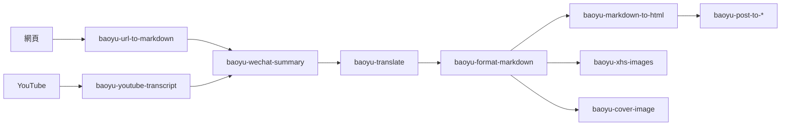

# 繁體中文 Fork 維護指南

本專案是 [JimLiu/baoyu-skills](https://github.com/JimLiu/baoyu-skills) 的繁體中文（臺灣正體）fork 版本。

## 安裝方式

### 註冊外掛市場

```bash
/plugin marketplace add yelban/baoyu-skills.TW
```

> **注意**：此 fork 的 marketplace 名稱為 `baoyu-skills-tw`，與原版 `baoyu-skills` 不同，可同時安裝兩者。

### 安裝技能

**方式一：透過瀏覽介面**

1. 選擇 **Browse and install plugins**
2. 選擇 **baoyu-skills-tw**
3. 選擇要安裝的外掛
4. 選擇 **Install now**

**方式二：直接安裝**

```bash
/plugin install baoyu-skills@baoyu-skills-tw
```

### 可用外掛

目前 marketplace 只有**一個 plugin**：`baoyu-skills`，內含 20 個技能，一次裝齊。

| 外掛 | 說明 | 技能數 |
|------|------|--------|
| **baoyu-skills** | Content generation, AI backends, and utility tools | 20 |

> **沒有相依機制**：`marketplace.json` 沒有 `dependencies` 欄位。不能單獨安裝某個 skill。要用就是整個 plugin。

### 更新已安裝的 Plugin

> **重要**：Plugin 更新是**兩階段**。光跑 `marketplace update` 還不夠，必須讓 plugin cache 也重抓，新內容才會真正進來。

**兩階段資料結構：**

```
~/.claude/plugins/
├── marketplaces/
│   └── baoyu-skills-tw/        ← 階段 1：marketplace 索引（git clone 的 yelban/baoyu-skills.TW）
│       └── .git/               ← git pull 可手動更新
└── cache/
    └── baoyu-skills-tw/
        └── baoyu-skills/
            └── <commit-sha>/   ← 階段 2：實際 plugin 內容快取（特定 sha 的 snapshot）
```

`installed_plugins.json` 用 `gitCommitSha` 把兩者綁起來。光更新 marketplace 而 plugin cache 沒重抓，Agent 載入的還是舊 sha。

**三種更新方式：**

| 方式 | 命令 | 適用 |
|------|------|------|
| **互動介面** | `/plugin` → Marketplaces 標籤 → Update marketplace → 切 Plugins 標籤 → Update plugin | 一般情境最方便 |
| **Slash 指令** | `/plugin marketplace update baoyu-skills-tw`<br>`/plugin uninstall baoyu-skills@baoyu-skills-tw`<br>`/plugin install baoyu-skills@baoyu-skills-tw` | 一次跑完，無 GUI 噪音 |
| **手動暴力** | `cd ~/.claude/plugins/marketplaces/baoyu-skills-tw && git pull`<br>`trash ~/.claude/plugins/cache/baoyu-skills-tw/baoyu-skills/<舊 sha>`<br>重啟 Agent | 前兩種沒效時的 escape hatch |

**完成後務必重啟 Agent**（關掉再開新 session），新 SKILL.md 內容才會被載入。

### 驗證安裝版本

```bash
# Marketplace 索引指到哪個 commit？
cd ~/.claude/plugins/marketplaces/baoyu-skills-tw && git rev-parse HEAD

# 實際安裝快取是哪個 sha？
cat ~/.claude/plugins/installed_plugins.json | python3 -m json.tool | grep -A 1 "gitCommitSha"

# Fork main 在 GitHub 的最新 HEAD
gh api repos/yelban/baoyu-skills.TW/commits/main --jq '.sha'
```

三者全部對齊 = 真的同步成功。

### 安裝範圍：user vs local

`installed_plugins.json` 內的 `scope` 欄位有兩種：

| Scope | 含義 | 觸發 |
|-------|------|------|
| `user` | 全域可用，所有 project 都能載入 | `/plugin install ... --scope user` |
| `local` | 綁在 `projectPath`，只在該 project 開 Agent 時載入 | `/plugin install ...` 預設或互動選 local |

如果你發現 plugin 只在某個特定 project 內看得到 skill（其他 project 沒有），檢查 `installed_plugins.json`：

```bash
cat ~/.claude/plugins/installed_plugins.json | python3 -m json.tool | grep -E "scope|projectPath"
```

要改成全域：

```bash
/plugin uninstall baoyu-skills@baoyu-skills-tw
/plugin install baoyu-skills@baoyu-skills-tw --scope user
```

### 故障排除

| 症狀 | 可能原因 | 解法 |
|------|---------|------|
| Agent 找不到任何 baoyu-* skill | Marketplace 已加但 plugin 未 install，或 scope 是 local 但開錯 project | `/plugin install ...`，或檢查 `installed_plugins.json` 的 `projectPath` |
| 新版功能（如 codex-imagegen path note）跑出舊行為 | Plugin cache 沒更新 | 走「手動暴力」三步法 |
| `/plugin install` 後仍是舊 sha | Marketplace 索引也沒刷 | 先 `/plugin marketplace update`，再 install |
| Skill 觸發了但找不到 wrapper（路徑錯誤） | 用了 cwd-drift 之前的版本 | 確認 plugin sha ≥ `9632253`（含 cwd-drift commit） |
| `codex exec` 報 "Not inside a trusted directory" | 同上，舊版沒帶 `--skip-git-repo-check` | 更新到 `9632253` 之後的版本 |

---

## 技能架構與相依關係

### 執行時相依圖

20 個 skill 中，`baoyu-image-gen` 是事實上的核心 — 6 個內容生成技能都會呼叫它產圖：

```mermaid
flowchart LR
    IMAGE_GEN[baoyu-image-gen<br/>圖片產生 backend]:::core

    AI[baoyu-article-illustrator] --> IMAGE_GEN
    COVER[baoyu-cover-image] --> IMAGE_GEN
    COMIC[baoyu-comic] --> IMAGE_GEN
    INFO[baoyu-infographic] --> IMAGE_GEN
    XHS[baoyu-xhs-images] --> IMAGE_GEN
    SLIDE[baoyu-slide-deck] --> IMAGE_GEN

    CODEX[packages/baoyu-codex-imagegen<br/>provider=codex-cli]:::codex -.--> IMAGE_GEN

    MD2HTML[baoyu-markdown-to-html]
    FMT[baoyu-format-markdown]
    WECHAT[baoyu-post-to-wechat]
    MD2HTML -.可選前處理.-> FMT
    MD2HTML -.theme fallback.-> WECHAT

    classDef core fill:#b91c1c,color:#fff,stroke:#fca5a5,stroke-width:2px
    classDef codex fill:#7c2d12,color:#fff,stroke:#fdba74
```

### 三種相依等級

| 等級 | 行為 | 例子 |
|------|------|------|
| **硬相依** | 沒有就跑不了 | `baoyu-cover-image` 需要 `baoyu-image-gen`（或其他圖片 backend）才能產圖 |
| **軟相依** | 偵測到才用，沒有就退化 | `baoyu-markdown-to-html` 偵測 CJK 內容才**詢問**是否呼叫 `baoyu-format-markdown` 前處理 |
| **設定相依** | 讀別的 skill 的 EXTEND.md | `baoyu-markdown-to-html` 讀 `baoyu-post-to-wechat` 的 `default_theme` 做 fallback |

### 圖片 backend 可替代

圖片相依在 SKILL.md 寫成「use whatever backend is available」— 不是綁死 `baoyu-image-gen`。實際選擇順序：

1. Runtime native（如 Codex 內建 `imagegen`、Hermes `image_generate`）
2. EXTEND.md `preferred_image_backend` 指定的
3. 自動偵測（只有一個非 native backend → 用它；多個 → 詢問）

所以「相依 `baoyu-image-gen`」實際是「**相依任一個圖片 backend**」。

### 上游版本遷移歷史

上游在 v2.0.0、v2.1.0 做了關鍵調整，影響 fork 檔案內舊有引用：

#### v2.0.0（反向命名）

| 階段 | 正式名 | 已棄用名 |
|------|--------|---------|
| v1.x 早期 | `baoyu-image-gen` | — |
| v1.x 後期 | `baoyu-imagine` | `baoyu-image-gen`（曾標 deprecated） |
| **v2.0.0 起** | **`baoyu-image-gen`**（恢復原名） | `baoyu-imagine`（已從 `marketplace.json` 移除） |

`baoyu-image-cards` ↔ `baoyu-xhs-images` 也是一樣的反向命名（v2.0.0 起 `baoyu-xhs-images` 才是正式名）。如果你的內容、prompt 或客製指令碼引用舊名稱，請統一更新；TW fork 已在 `sync-upstream.sh` 與 `apply-customizations.sh` 內完成相應更新。

#### v2.1.0（codex-imagegen 原生化）

原本由 TW fork 提供的 `scripts/codex-imagegen.sh` 與 `scripts/codex-imagegen/*.ts`（由 PR [#158](https://github.com/JimLiu/baoyu-skills/pull/158) 進入上游）已被升級重整成：

- **`packages/baoyu-codex-imagegen/`** — 上游 workspace 內的 production-grade 套件
- **`baoyu-image-gen --provider codex-cli`** — skill 內建原生支援，毋須跳出去呼叫 shell wrapper

TW fork 自此**移除自有副本**，直接跟隨上游。叫用範例：

```bash
# 推薦：透過 baoyu-image-gen pipeline
${BUN_X} skills/baoyu-image-gen/scripts/main.ts --provider codex-cli \
  --prompt-file prompts/01-cover.md --image cover.png --ar 16:9

# 直接呼叫套件入口
bun packages/baoyu-codex-imagegen/src/main.ts \
  --image cover.png --prompt-file prompts/01-cover.md --aspect 16:9
```

詳見上游維護的 [docs/codex-imagegen-backend.md](codex-imagegen-backend.md)。

### 內容生產鏈

實務上常見的呼叫鏈（每一步都可獨立使用，但組合起來是完整工作流）：



---

## 同步策略：Reset + Re-apply

### 為什麼不用 Merge/Rebase？

| 策略 | 問題 |
|------|------|
| Merge | 簡繁轉換涉及大量 .md 檔案，幾乎每個檔案都衝突 |
| Rebase | 同上，且歷史更複雜 |
| **Reset + Re-apply** | **無衝突、乾淨、可重複執行** |

簡繁轉換是**冪等操作**（同一份簡體輸入永遠得到相同繁體輸出），所以每次同步後重新執行轉換是最簡潔的做法。

### 同步流程（完整步驟）

```bash
# 1. 備份 TW 特有檔案
mkdir -p /tmp/baoyu-tw-backup
cp docs/traditional-chinese-fork.md /tmp/baoyu-tw-backup/
cp scripts/apply-customizations.sh scripts/convert-to-traditional.sh scripts/sync-upstream.sh /tmp/baoyu-tw-backup/

# 2. 取得上游並重設
git fetch upstream
git reset --hard upstream/main

# 3. 批次 opencc 轉換（排除 node_modules）
find skills/ -name "*.md" -not -path "*/node_modules/*" -type f | while read f; do
  converted=$(opencc -c s2twp < "$f")
  if [ "$converted" != "$(cat "$f")" ]; then
    echo "$f"
    echo "$converted" > "$f"
  fi
done

# 4. 轉換 CHANGELOG.zh.md
opencc -c s2twp < CHANGELOG.zh.md > /tmp/changelog-tw.md && mv /tmp/changelog-tw.md CHANGELOG.zh.md

# 5. 修正已知 opencc false positives（見下方清單）
find . -name "*.md" -not -path "./.git/*" -not -path "*/node_modules/*" \
  -not -path "./docs/traditional-chinese-fork.md" \
  -exec sed -i '' 's/通義永珍/通義永珍/g' {} +

# 6. 套用 TW 元資料
#    - marketplace.json: name → baoyu-skills-tw, description 加 (繁體中文版),
#      version 加 -tw 字尾, 加 maintainer 區塊
#    - CLAUDE.md: version 加 -tw, 加 fork 說明和 Fork Maintenance 區段
#    - CHANGELOG.md / CHANGELOG.zh.md: 加入 TW 版本條目
#    - .gitignore: 加入 backups/ 等 TW 特有專案

# 7. 還原 TW 特有檔案
cp /tmp/baoyu-tw-backup/traditional-chinese-fork.md docs/
cp /tmp/baoyu-tw-backup/*.sh scripts/

# 8. 提交
git add -A
git commit -m "chore: sync upstream vX.Y.Z through vA.B.C and convert to Traditional Chinese (Taiwan)"

# 9. 建立版本 tag
#    從 marketplace.json 取得 -tw 版本號，建立 git tag
TW_VERSION=$(node -e "console.log(require('./.claude-plugin/marketplace.json').metadata.version)")
git tag "v${TW_VERSION}"

# 10. 推送（force-with-lease 因為 reset 改寫了歷史）
git push --force-with-lease && git push --tags
```

### 自動化指令碼

```
scripts/
├── sync-upstream.sh          # 主指令碼：同步上游並重新轉換
├── convert-to-traditional.sh # 簡繁轉換（opencc s2twp）
└── apply-customizations.sh   # 套用 fork 自訂修改
```

**旗標**：

| 旗標 | 說明 |
|------|------|
| （無） | 互動模式，會詢問 y/N |
| `--yes` / `-y` | 自動確認，跳過互動 |
| `--push` / `-p` | 完成後自動 `git push --force-with-lease` 並推送 tag |
| `--dry-run` / `-n` | 隔離 worktree 演練，主工作區零影響（與 `--push` 互斥） |
| `--help` / `-h` | 顯示用法 |

**常用組合**：

```bash
./scripts/sync-upstream.sh --dry-run      # 預覽：看實際變更，不動主工作區
./scripts/sync-upstream.sh --yes --push   # 一鍵完成（推薦給 agent）
./scripts/sync-upstream.sh --yes          # 自動確認但不推送
./scripts/sync-upstream.sh                # 互動模式
```

**Dry-run 機制**：

在 `.worktrees/sync-dryrun-{YYYYMMDD-HHMMSS}/` 建立隔離 worktree，跑完整流程到 commit（含繁轉、自訂修改、修正 false positives）。Tag 是 repo-level 共享，dry-run 模式**不建立 tag**，只顯示「會建立 v{X.Y.Z}-tw」。結束後輸出：

- worktree 路徑
- 變更 diff stat
- 檢視完整 diff 的指令
- 清理 worktree 的指令（`git worktree remove --force ...`）

指令碼自動處理：步驟 1–10（含自動打 tag、自動修正已知 opencc false positives）。加上 `--push` 連步驟 11 也一起完成。

---

## 已知 opencc False Positives

opencc `s2twp` 模式會對部分詞彙做錯誤轉換。每次同步後必須手動修正。

| 原文（正確） | opencc 錯誤轉換 | 出現位置 | 修正方式 |
|-------------|----------------|---------|---------|
| 通義永珍 | 通義永珍 | `skills/baoyu-image-gen/SKILL.md` | `sed -i '' 's/通義永珍/通義永珍/g'` |

> **說明**：opencc 將「永珍」轉為「永珍」是因為 [永珍](https://zh.wikipedia.org/wiki/%E6%B0%B8%E7%8F%8D) 是寮國首都「Vientiane」的臺灣慣用譯名（對應大陸譯名「永珍」）。但「通義永珍」是阿里雲產品名「Tongyi Wanxiang」，非地名，應保留「永珍」。同步指令碼會自動修正此誤轉。

### 如何發現新的 false positive

同步後執行比對：

```bash
find skills/ -name "*.md" -not -path "*/node_modules/*" -type f | while read f; do
  diff_output=$(diff <(cat "$f") <(opencc -c s2twp < "$f") 2>/dev/null)
  if [ -n "$diff_output" ]; then
    echo "=== $f ==="
    echo "$diff_output"
  fi
done
```

如果出現差異，代表 opencc 還想轉換某些詞。確認是 false positive 後加入上方表格和修正指令。

---

## 自訂修改清單

### marketplace.json

```json
{
  "name": "baoyu-skills-tw",
  "owner": {
    "name": "Jim Liu (寶玉)",
    "email": "junminliu@gmail.com"
  },
  "metadata": {
    "description": "Skills shared by Baoyu (繁體中文版)",
    "version": "X.Y.Z-tw"
  },
  "maintainer": {
    "name": "yelban",
    "note": "Traditional Chinese (Taiwan) fork"
  }
}
```

- **name**: `baoyu-skills-tw`（避免與原版衝突）
- **owner**: 保留原作者，尊重著作權
- **version**: 跟隨上游版號 + `-tw` 字尾
- **maintainer**: TW fork 維護者

### CLAUDE.md

- Version 加 `-tw` 字尾
- 加入 fork 說明引用區塊
- 加入 `Fork Maintenance (baoyu-skills.TW)` 區段
- Release Process 加入 `釋出` 觸發詞

### CHANGELOG

- 在最上方加入 `X.Y.Z-tw` 版本條目
- `CHANGELOG.zh.md` 的上游簡體內容一併轉為繁體

### .gitignore

- 加入 `backups/`

### TW 特有檔案

| 檔案 | 用途 |
|------|------|
| `docs/traditional-chinese-fork.md` | 本檔案 |
| `scripts/sync-upstream.sh` | 自動同步上游 |
| `scripts/convert-to-traditional.sh` | opencc 批次轉換 |
| `scripts/apply-customizations.sh` | 套用 TW 元資料 |

---

## 前置要求

- [OpenCC](https://github.com/BYVoid/OpenCC)：`brew install opencc`
- Bun（透過 npx 自動安裝）
- Node.js 環境

## 轉換範圍

### 會轉換的檔案

- `skills/**/*.md`（排除 `node_modules/`）
- `CHANGELOG.zh.md`

### 不會轉換的檔案

- `.ts`、`.css`、`.json` 等程式碼檔案（內含簡體字串是上游原始碼，不應修改）
- `node_modules/` 下的所有檔案
- `CHANGELOG.md`（英文版）
- `README.md`、`README.zh.md`（跟隨上游，另外手動處理）
